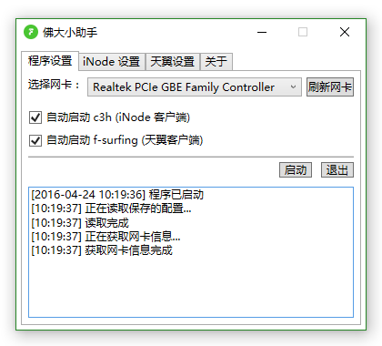

# 佛大小助手

> 佛大传奇，伴你成长；一角校园，十分精彩。

下载地址：https://github.com/fosuhelper/fosuhelper/releases/latest

## 使用方法

> Windows 8/8.1/10 用户可以安装后直接运行，Windows 7 则可能需要安装 .net Framework 4.5，下载地址：http://download.microsoft.com/download/b/a/4/ba4a7e71-2906-4b2d-a0e1-80cf16844f5f/dotnetfx45_full_x86_x64.exe

- 下载并安装 FosuHelper 和 WinPcap，然后运行`佛大小助手`
- 选择正确的有线网卡
- 如果需要 iNode 认证，则在 `iNode 设置` 标签页中填写你的 **iNode 客户端**的账号密码。点击`保存`按钮可以保存你的账号密码，以便下次运行程序时可以不用再次输入。
- 如果需要天翼认证，则在 `天翼设置` 标签页中填写你的**天翼客户端**（二次认证网页）的账号密码。点击`保存`按钮可以保存账号密码。
- 需要启动程序后自动进行 iNode 认证，请勾选 `自动启动 c3h (iNode 客户端)`（默认已开启）；同理可开启自动进行天翼认证。
- 完成设置后，点击`程序设置`标签页的`启动`可以发起上网认证。

## 说明
iNode 认证部分用的是 KiritoA 的 c3h-client，源码没有收录在本项目的代码仓库，可以自行到 https://github.com/KiritoA/c3h_client 获取

## 互动
如果你在使用的过程中遇到问题/发现 Bug，可以给我们提交 [issue](https://github.com/fosuhelper/fosuhelper/issues)

如果你对这个项目感兴趣并且你对其进行了改进，欢迎发起 `Pull Request`

## 开源协议
本项目遵循 GNU GPLv3 开源协议